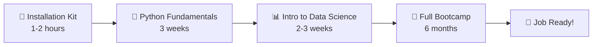

# 🎓 Metrica Academy - Data Science Bootcamp Course Collection

<div align="center">
  
  
  
  
</div>

---

## 🌟 Welcome to Your Complete Data Science Journey!

This repository contains a **comprehensive collection of educational materials** designed to transform complete beginners into job-ready data scientists. From your very first line of code to building production-ready machine learning systems, everything you need is here.

## 📚 What's Included?

This collection provides **four integrated learning modules** that build upon each other:

### 🔧 [Installation Kit](installation-kit/)
*Your technical foundation starts here*
- **Beginner-friendly setup guides** for Windows, Mac, and Linux
- **Automated installation scripts** with comprehensive verification
- **Troubleshooting documentation** for common issues
- **Complete conda environment** with all data science tools

### 🐍 [Python Fundamentals](python-fundamentals/)
*Master programming from scratch*
- **3-week intensive course** designed for absolute beginners
- **Live coding methodology** with real-world analogies
- **Progressive projects**: Personal finance tracker → Text adventure game → Capstone
- **Complete lesson plans** with exercises and homework

### 📊 [Introduction to Data Science](intro-to-data-science/)
*Hands-on data science with real projects*
- **Interactive Jupyter notebooks** with gamification
- **10 synthetic datasets** across healthcare, finance, retail, and more
- **Real-world applications**: COVID analysis, fraud detection, recommendation systems
- **Professional visualization** and analysis tools

### 🎯 [Complete Bootcamp Curriculum](ds-bootcamp-curriculum/)
*Your roadmap to becoming a data scientist*
- **6-month structured program** (240 hours total)
- **8 comprehensive modules** covering the full data science pipeline
- **15+ portfolio projects** with industry applications
- **Career preparation** and job placement support

---

## 🚀 Quick Start Guide

### Prerequisites
- **Computer**: Windows, Mac, or Linux with 8GB+ RAM
- **Internet**: Stable connection for downloads and virtual sessions
- **Time**: 10-15 hours per week commitment
- **Math**: High school level (no advanced math required to start!)
- **Programming Experience**: None needed - we start from zero!

### Option 1: Complete Setup (Recommended)
```bash
# 1. Clone this repository
git clone https://github.com/your-org/ds-bootcamp-courses.git
cd ds-bootcamp-courses

# 2. Set up your environment
cd installation-kit
# Follow your OS-specific guide:
# - Windows: guides/INSTALL_WINDOWS.md
# - Mac: guides/INSTALL_MAC.md  
# - Linux: guides/INSTALL_LINUX.md

# 3. Verify everything works
python scripts/verify_setup.py

# 4. Start learning!
cd ../intro-to-data-science
jupyter notebook intro-to-data-science.ipynb
```

### Option 2: Individual Module Setup
Each module can be used independently. See the README in each folder for specific setup instructions.

---

## 🗺️ Learning Path

### Recommended Journey (6-8 months)


### Alternative Paths

**🏃‍♀️ Accelerated Track (3-4 months)**
- Skip Python Fundamentals if you have programming experience
- Focus on data science modules and projects

**👨‍🏫 Instructor-Led Course**
- Use Python Fundamentals for teaching beginners
- Integrate with your existing curriculum

**🔬 Self-Study Data Science**
- Start with Introduction to Data Science
- Use as supplement to other learning materials

---

## 📖 Course Content Overview

### Module 1: Installation Kit
- ✅ Cross-platform setup guides
- ✅ Conda environment with 40+ packages
- ✅ Verification and testing scripts
- ✅ Comprehensive troubleshooting

### Module 2: Python Fundamentals (30 hours)
**Week 1: Foundation Building**
- Variables, data types, and operations
- Lists and dictionaries
- Project: Personal Finance Tracker

**Week 2: Logic & Control**
- Conditionals and loops
- Functions and code organization
- Project: Text Adventure Game

**Week 3: Real-World Applications**
- File I/O and error handling
- Working with data
- Capstone: Healthcare/Finance/Retail project

### Module 3: Introduction to Data Science
**Interactive Learning with Real Datasets**
- 🏥 Healthcare: COVID-19 risk analysis
- 💳 Finance: Fraud detection patterns
- 🏠 Real Estate: Price prediction modeling
- 🎬 Entertainment: Recommendation systems
- 🛍️ Retail: Customer analytics

### Module 4: Complete Bootcamp Curriculum (240 hours)
**8 Comprehensive Modules**
1. Introduction to Data Science (3 weeks)
2. Programming & Data Management (4 weeks)
3. Data Visualization & EDA (3 weeks)
4. Machine Learning (4 weeks)
5. Deep Learning & NLP (4 weeks)
6. Data Engineering & Production (3 weeks)
7. Statistics & A/B Testing (2 weeks)
8. Soft Skills & Career Prep (1 week)

---

## 🎯 What You'll Build

### 📁 Portfolio Projects
By completion, you'll have built:

**Beginner Projects**
- Personal finance tracking system
- Interactive text adventure game
- Data analysis dashboards

**Intermediate Projects**
- Healthcare risk assessment tool
- Fraud detection system
- Movie recommendation engine
- Customer segmentation analysis

**Advanced Projects**
- Machine learning prediction models
- Deep learning applications
- Production data pipelines
- A/B testing frameworks

**Capstone Project**
- End-to-end data science application
- Professional presentation
- Deployed solution with documentation

---

## 🛠️ Technology Stack

### Programming & Environment
- **Python 3.8+** - Primary programming language
- **Jupyter Notebooks** - Interactive development environment
- **Git & GitHub** - Version control and collaboration
- **Conda/Miniconda** - Package and environment management

### Data Science Libraries
- **Data Manipulation**: pandas, numpy
- **Visualization**: matplotlib, seaborn, plotly
- **Machine Learning**: scikit-learn, scipy
- **Deep Learning**: tensorflow, pytorch (optional)
- **Statistics**: statsmodels, pingouin

### Development Tools
- **Code Quality**: black, flake8, isort
- **Testing**: pytest
- **Documentation**: sphinx
- **Cloud**: AWS, Google Cloud (advanced modules)

---

## 👥 Who This Is For

### 🎯 Perfect for:
- **Complete beginners** who want to learn data science from scratch
- **Career changers** looking to transition into tech
- **Students** seeking structured, project-based learning
- **Professionals** wanting to add data skills to their toolkit
- **Instructors** teaching data science fundamentals

### 📚 Educational Use:
- **Bootcamps** - Complete curriculum ready to use
- **Universities** - Supplement existing computer science programs
- **Corporate Training** - Upskill employees in data analytics
- **Self-Study** - Comprehensive materials for independent learning

---

## 🎓 Learning Outcomes

Upon completion of the full program, graduates will be able to:

### Technical Skills
- ✅ **Program in Python** with confidence and best practices
- ✅ **Manipulate and analyze** large datasets efficiently
- ✅ **Create compelling visualizations** and dashboards
- ✅ **Build machine learning models** from data to deployment
- ✅ **Work with databases** and design data pipelines
- ✅ **Apply statistical methods** and conduct A/B tests
- ✅ **Deploy applications** to cloud platforms

### Professional Skills
- ✅ **Communicate findings** to technical and business audiences
- ✅ **Manage data science projects** from inception to completion
- ✅ **Collaborate effectively** using industry-standard tools
- ✅ **Present technical work** professionally
- ✅ **Continue learning** new technologies independently

### Career Readiness
- ✅ **Portfolio** of 15+ professional projects
- ✅ **GitHub profile** showcasing technical abilities
- ✅ **Interview preparation** for data science roles
- ✅ **Industry knowledge** of current tools and practices
- ✅ **Network connections** through peer collaboration

---

## 📈 Success Stories

> *"I went from never having coded before to landing my first data science job in 8 months. The progressive structure and real-world projects made all the difference."*  
> **— Sarah K., Marketing → Data Scientist**

> *"As an instructor, these materials saved me hundreds of hours of preparation. The analogies and interactive components keep students engaged."*  
> **— Dr. Miguel R., University Professor**

> *"The installation guides are amazing! I helped 5 colleagues set up their environments using these step-by-step instructions."*  
> **— Priya S., Business Analyst**

---

## 🤝 Community & Support

### Getting Help
- **📚 Documentation**: Comprehensive guides in each module
- **🔧 Troubleshooting**: Common issues and solutions included
- **💬 Discussions**: Use GitHub Discussions for questions
- **🐛 Issues**: Report bugs or request features

### Contributing
We welcome contributions from the community! See our [Contributing Guidelines](CONTRIBUTING.md) for details on:
- Improving documentation
- Adding new datasets
- Creating additional exercises
- Translating materials
- Reporting issues

### Community Guidelines
- **Be Respectful**: Support all learners regardless of background
- **Be Helpful**: Share knowledge and assist others
- **Be Patient**: Remember everyone learns at their own pace
- **Be Professional**: Maintain high standards in all interactions

---

## 📊 Repository Stats

- **📁 4 integrated modules** covering complete learning path
- **📓 100+ Jupyter notebooks** with interactive content
- **📊 20+ datasets** for hands-on practice
- **🖼️ 75+ educational images** and visualizations
- **⚡ 15+ verification scripts** ensuring smooth setup
- **📚 50+ hours** of structured learning content
- **🎯 25+ projects** for portfolio development

---

## 🔄 Version Information

- **Current Version**: 2.0
- **Python Compatibility**: 3.8, 3.9, 3.10, 3.11
- **Last Updated**: 2024
- **Tested Platforms**: Windows 10/11, macOS 12+, Ubuntu 20.04+

---

## 📜 License & Usage

This project is licensed under the **MIT License** - see the [LICENSE](LICENSE) file for details.

### Commercial Use
- ✅ Educational institutions may use freely
- ✅ Corporate training programs welcome
- ✅ Bootcamps and courses may adapt materials
- ✅ Attribution appreciated but not required

---

## 🙏 Acknowledgments

**Special Thanks To:**
- **Metrica Academy** - For providing the educational vision and resources
- **Our Students** - For their enthusiasm, feedback, and success stories
- **Contributors** - For continuously improving these materials
- **The Data Science Community** - For sharing knowledge and best practices

---

## 🌟 Star This Repository!

If you find these materials helpful, please ⭐ **star this repository** to help others discover it and show your support for open-source education!

---

<div align="center">
  
### 🚀 Ready to Start Your Data Science Journey?

**[Begin with the Installation Kit →](installation-kit/)**

---

**Questions? Problems? Suggestions?**  
Don't hesitate to reach out - we're here to help you succeed! 🎉

*Happy Learning!*  
**— The Metrica Academy Team**

</div>