# 🎓 Metrica Academy - Data Science Bootcamp Course Collection

<div align="center">
  
  
  
  
</div>

---

## 🌟 Welcome to Your Data Science Journey!

This repository contains the **foundational educational materials** for the Metrica Academy Data Science Bootcamp. This collection focuses on the first essential module - introducing students to data science concepts and teaching Python programming from scratch. Additional modules covering visualization, exploratory data analysis, machine learning, and deep learning will be added as the bootcamp progresses.

## 📚 What's Included?

This repository contains the **foundational materials** for Module 1 of the Data Science Bootcamp:

### 🔧 [Installation Kit](installation-kit/)
*Your technical foundation starts here*
- **Beginner-friendly setup guides** for Windows, Mac, and Linux
- **Automated installation scripts** with comprehensive verification
- **Troubleshooting documentation** for common issues
- **Complete conda environment** with all data science tools

### 🐍 [Python Fundamentals](python-fundamentals/)
*Master programming from scratch*
- **3-week intensive course** designed for absolute beginners
- **Live coding methodology** with real-world analogies
- **Progressive projects**: Personal finance tracker → Text adventure game → Capstone
- **Complete lesson plans** with exercises and homework

### 📊 [Introduction to Data Science](intro-to-data-science/)
*Hands-on data science with real projects*
- **Interactive Jupyter notebooks** with gamification
- **10 synthetic datasets** across healthcare, finance, retail, and more
- **Real-world applications**: COVID analysis, fraud detection, recommendation systems
- **Professional visualization** and analysis tools

### 🎯 [Complete Bootcamp Curriculum](ds-bootcamp-curriculum/)
*Overview and structure of the full 6-month program*
- **Program overview** and detailed syllabus
- **6-month structured curriculum** outline (240 hours total)
- **Assessment structure** and learning objectives
- **Career preparation** framework

---

## 🚀 Quick Start Guide

### Prerequisites
- **Computer**: Windows, Mac, or Linux with 8GB+ RAM
- **Internet**: Stable connection for downloads and virtual sessions
- **Time**: 10-15 hours per week commitment
- **Math**: High school level (no advanced math required to start!)
- **Programming Experience**: None needed - we start from zero!

### Option 1: Complete Setup (Recommended)
```bash
# 1. Clone this repository
git clone https://github.com/your-org/ds-bootcamp-courses.git
cd ds-bootcamp-courses

# 2. Set up your environment
cd installation-kit
# Follow your OS-specific guide:
# - Windows: guides/INSTALL_WINDOWS.md
# - Mac: guides/INSTALL_MAC.md  
# - Linux: guides/INSTALL_LINUX.md

# 3. Verify everything works
python scripts/verify_setup.py

# 4. Start learning!
cd ../intro-to-data-science
jupyter notebook intro-to-data-science.ipynb
```

### Option 2: Individual Module Setup
Each module can be used independently. See the README in each folder for specific setup instructions.

---

## 🗺️ Learning Path

### Module 1 Learning Path (4-5 weeks)

```mermaid
graph LR
    A[🔧 Installation Kit<br/>1-2 hours] --> B[🐍 Python Fundamentals<br/>3 weeks]
    B --> C[📊 Intro to Data Science<br/>2-3 weeks]  
    C --> D[📈 Ready for Advanced Modules]
```


### Alternative Paths

**🏃‍♀️ Accelerated Track (2-3 weeks)**
- Skip Python Fundamentals if you have programming experience
- Jump directly to Introduction to Data Science

**👨‍🏫 Instructor-Led Course**
- Use Python Fundamentals for teaching beginners
- Integrate with your existing curriculum

**🔬 Self-Study Data Science**
- Start with Introduction to Data Science
- Use as preparation for advanced modules

---


## 🛠️ Technology Stack

### Programming & Environment
- **Python 3.8+** - Primary programming language
- **Jupyter Notebooks** - Interactive development environment
- **Git & GitHub** - Version control and collaboration
- **Conda/Miniconda** - Package and environment management

### Data Science Libraries (Foundational)
- **Data Manipulation**: pandas, numpy
- **Visualization**: matplotlib, seaborn, plotly
- **Interactive Widgets**: ipywidgets
- **Basic Statistics**: scipy

### Development Tools
- **Code Quality**: black, flake8, isort (where available)
- **Documentation**: Jupyter notebooks with markdown
- **Version Control**: Git and GitHub

---

## 👥 Who This Is For

### 🎯 Perfect for:
- **Complete beginners** who want to learn data science from scratch
- **Career changers** looking to transition into tech
- **Students** seeking structured, project-based learning
- **Professionals** wanting to add data skills to their toolkit
- **Instructors** teaching data science fundamentals

### 📚 Educational Use:
- **Bootcamps** - Complete curriculum ready to use
- **Universities** - Supplement existing computer science programs
- **Corporate Training** - Upskill employees in data analytics
- **Self-Study** - Comprehensive materials for independent learning

---

## 🎓 Learning Outcomes

Upon completion of Module 1, students will be able to:

### Technical Skills
- ✅ **Program in Python** with confidence using core language features
- ✅ **Work with data structures** like lists, dictionaries, and files
- ✅ **Create basic data analysis** scripts and visualizations
- ✅ **Apply programming logic** with conditionals, loops, and functions
- ✅ **Handle errors** and debug common programming issues
- ✅ **Use Jupyter notebooks** for interactive development

### Professional Skills
- ✅ **Follow coding best practices** and write readable code
- ✅ **Think algorithmically** and break down complex problems
- ✅ **Use Git and GitHub** for version control
- ✅ **Document work clearly** for future reference
- ✅ **Build foundational skills** for data science specialization

---


## 🤝 Community & Support

### Getting Help
- **📚 Documentation**: Comprehensive guides in each module
- **🔧 Troubleshooting**: Common issues and solutions included
- **💬 Discussions**: Use GitHub Discussions for questions
- **🐛 Issues**: Report bugs or request features

### Contributing
We welcome contributions from the community! See our [Contributing Guidelines](CONTRIBUTING.md) for details on:
- Improving documentation
- Adding new datasets
- Creating additional exercises
- Translating materials
- Reporting issues

### Community Guidelines
- **Be Respectful**: Support all learners regardless of background
- **Be Helpful**: Share knowledge and assist others
- **Be Patient**: Remember everyone learns at their own pace
- **Be Professional**: Maintain high standards in all interactions

---

## 📊 Repository Stats

- **📁 4 foundational components** for Module 1
- **📓 15+ Jupyter notebooks** with interactive content
- **📊 10+ datasets** for hands-on practice
- **🖼️ 75+ educational images** and visualizations
- **⚡ 15+ verification scripts** ensuring smooth setup
- **📚 30+ hours** of structured learning content in Module 1
- **🎯 5+ projects** building core skills

---

## 🔄 Version Information

- **Current Version**: 2.0
- **Python Compatibility**: 3.8, 3.9, 3.10, 3.11
- **Last Updated**: 2024
- **Tested Platforms**: Windows 10/11, macOS 12+, Ubuntu 20.04+

---

## 📜 License & Usage

This project is licensed under the **MIT License** - see the [LICENSE](LICENSE) file for details.

### Commercial Use
- ✅ Educational institutions may use freely
- ✅ Corporate training programs welcome
- ✅ Bootcamps and courses may adapt materials
- ✅ Attribution appreciated but not required

---

## 🙏 Acknowledgments

**Special Thanks To:**
- **Metrica Academy** - For providing the educational vision and resources
- **Our Students** - For their enthusiasm, feedback, and success stories
- **Contributors** - For continuously improving these materials
- **The Data Science Community** - For sharing knowledge and best practices

---

## 🌟 Star This Repository!

If you find these materials helpful, please ⭐ **star this repository** to help others discover it and show your support for open-source education!

---

<div align="center">
  
### 🚀 Ready to Start Your Data Science Journey?

**[Begin with the Installation Kit →](installation-kit/)**

---

**Questions? Problems? Suggestions?**  
Don't hesitate to reach out - we're here to help you succeed! 🎉

*Happy Learning!*  
**— The Metrica Academy Team**

</div>