# 🎓 Metrica Academy - Data Science Bootcamp Course Collection

<div align="center">
  
  
  
  
</div>

---

## 🌟 Welcome to Your Data Science Journey!

The Metrica Academy Data Science Bootcamp is a comprehensive 6-month program designed to transform complete beginners into job-ready data scientists. This repository serves as the central hub for all course materials, from foundational programming to advanced machine learning techniques.

## 📚 What's Included?

This repository contains **comprehensive educational materials** covering the essentials of data science:

- **🔧 Environment Setup** - Installation guides, troubleshooting documentation, and verification tools to get students started quickly
- **🐍 Python Programming** - From absolute basics to advanced concepts, with hands-on projects and exercises
- **📊 Data Science Fundamentals** - Core concepts, methodologies, and real-world applications using interactive notebooks
- **📈 Data Analysis & Visualization** - Techniques for exploring, analyzing, and presenting data effectively
- **🤖 Machine Learning** - Supervised and unsupervised learning algorithms with practical implementations
- **🧠 Deep Learning & AI** - Neural networks, NLP, and modern AI applications
- **📐 Statistics & Mathematics** - Essential statistical concepts and mathematical foundations
- **🚀 Production & Deployment** - Best practices for deploying models and creating data pipelines
- **💼 Career Preparation** - Portfolio development, interview preparation, and industry insights

---

## 🚀 Quick Start Guide

### Prerequisites
- **Computer**: Windows, Mac, or Linux with 8GB+ RAM
- **Internet**: Stable connection for downloads and virtual sessions
- **Time**: 10-15 hours per week commitment
- **Math**: High school level (no advanced math required to start!)
- **Programming Experience**: None needed - we start from zero!

### Option 1: Complete Setup (Recommended)
```bash
# 1. Clone this repository
git clone https://github.com/your-org/ds-bootcamp-courses.git
cd ds-bootcamp-courses

# 2. Set up your environment
cd installation-kit
# Follow your OS-specific guide:
# - Windows: guides/INSTALL_WINDOWS.md
# - Mac: guides/INSTALL_MAC.md  
# - Linux: guides/INSTALL_LINUX.md

# 3. Verify everything works
python scripts/verify_setup.py

# 4. Start learning!
cd ../intro-to-data-science
jupyter notebook intro-to-data-science.ipynb
```

### Option 2: Individual Module Setup
Each module can be used independently. See the README in each folder for specific setup instructions.

---

## 🗺️ Learning Path

### Complete Program Path (6 months)

```mermaid
graph LR
    A[🔧 Environment Setup<br/>1-2 hours] --> B[🐍 Python Fundamentals<br/>3-4 weeks]
    B --> C[📊 Data Science Core<br/>8 weeks]  
    C --> D[🤖 Machine Learning<br/>8 weeks]
    D --> E[🧠 Advanced Topics<br/>6 weeks]
    E --> F[💼 Job Ready!]
```


### Flexible Learning Options

**🏃‍♀️ Accelerated Track**
- For those with programming experience
- Focus on data science specific modules

**👨‍🏫 Instructor-Led Bootcamp**
- Full 6-month structured program
- Live sessions with hands-on projects

**🔬 Self-Paced Learning**
- Work through materials at your own speed
- Access to all resources and exercises

---


## 🛠️ Technology Stack

### Programming & Environment
- **Python 3.8+** - Primary programming language
- **Jupyter Notebooks** - Interactive development environment
- **Git & GitHub** - Version control and collaboration
- **Conda/Miniconda** - Package and environment management

### Data Science Libraries
- **Data Manipulation**: pandas, numpy
- **Visualization**: matplotlib, seaborn, plotly
- **Machine Learning**: scikit-learn, tensorflow, pytorch
- **Statistics**: scipy, statsmodels

### Development Tools
- **Interactive Development**: Jupyter notebooks and JupyterLab
- **Version Control**: Git and GitHub
- **Code Quality**: Best practices and style guidelines

---

## 👥 Who This Is For

### 🎯 Perfect for:
- **Complete beginners** who want to learn data science from scratch
- **Career changers** looking to transition into tech
- **Students** seeking structured, project-based learning
- **Professionals** wanting to add data skills to their toolkit
- **Instructors** teaching data science fundamentals

### 📚 Educational Use:
- **Bootcamps** - Complete curriculum ready to use
- **Universities** - Supplement existing computer science programs
- **Corporate Training** - Upskill employees in data analytics
- **Self-Study** - Comprehensive materials for independent learning

---

## 🎓 Program Learning Outcomes

Upon completion of the full bootcamp, graduates will be able to:

### Technical Skills
- ✅ **Program confidently in Python** for data science applications
- ✅ **Analyze and visualize data** using industry-standard tools
- ✅ **Build and deploy machine learning models** from scratch
- ✅ **Apply statistical methods** to real-world problems
- ✅ **Work with databases** and big data technologies
- ✅ **Implement deep learning** solutions for complex problems

### Professional Skills
- ✅ **Communicate insights effectively** to technical and non-technical audiences
- ✅ **Manage end-to-end data science projects**
- ✅ **Collaborate using version control** and agile methodologies
- ✅ **Build a professional portfolio** showcasing diverse projects
- ✅ **Navigate the job market** with confidence and preparation

---


## 🤝 Community & Support

### Getting Help
- **📚 Documentation**: Comprehensive guides in each module
- **🔧 Troubleshooting**: Common issues and solutions included
- **💬 Discussions**: Use GitHub Discussions for questions
- **🐛 Issues**: Report bugs or request features

### Contributing
We welcome contributions from the community! See our [Contributing Guidelines](CONTRIBUTING.md) for details on:
- Improving documentation
- Adding new datasets
- Creating additional exercises
- Translating materials
- Reporting issues

### Community Guidelines
- **Be Respectful**: Support all learners regardless of background
- **Be Helpful**: Share knowledge and assist others
- **Be Patient**: Remember everyone learns at their own pace
- **Be Professional**: Maintain high standards in all interactions

---

## 📊 Program Overview

- **⏱️ Duration**: 6 months (240 hours total)
- **📅 Schedule**: Part-time compatible (10-15 hours/week)
- **🎯 Projects**: 15+ hands-on projects across all modules
- **📊 Datasets**: Real-world and synthetic data for practice
- **🛠️ Tools**: Industry-standard data science stack
- **💼 Career Support**: Portfolio development and job preparation
- **🎓 Certificate**: Completion certificate upon graduation

---

## 🔄 Version Information

- **Current Version**: 2.0
- **Python Compatibility**: 3.8, 3.9, 3.10, 3.11
- **Last Updated**: 2024
- **Tested Platforms**: Windows 10/11, macOS 12+, Ubuntu 20.04+

---

## 📜 License & Usage

This project is licensed under the **MIT License** - see the [LICENSE](LICENSE) file for details.

### Commercial Use
- ✅ Educational institutions may use freely
- ✅ Corporate training programs welcome
- ✅ Bootcamps and courses may adapt materials
- ✅ Attribution appreciated but not required

---

## 🙏 Acknowledgments

**Special Thanks To:**
- **Metrica Academy** - For providing the educational vision and resources
- **Our Students** - For their enthusiasm, feedback, and success stories
- **Contributors** - For continuously improving these materials
- **The Data Science Community** - For sharing knowledge and best practices

---

## 🌟 Star This Repository!

If you find these materials helpful, please ⭐ **star this repository** to help others discover it and show your support for open-source education!

---

<div align="center">
  
### 🚀 Ready to Start Your Data Science Journey?

**[Begin with the Installation Kit →](installation-kit/)**

---

**Questions? Problems? Suggestions?**  
Don't hesitate to reach out - we're here to help you succeed! 🎉

*Happy Learning!*  
**— The Metrica Academy Team**

</div>