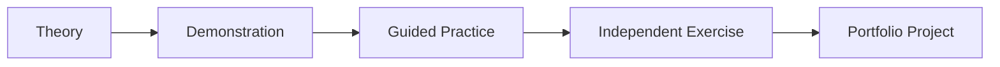

# 🚀 Introduction to Data Science Bootcamp

Welcome to the **Metrica Academy Data Science Bootcamp**! This repository contains comprehensive course materials for the introductory module of our data science program.

## 📚 Course Overview

This is the **first class** of the Data Science Bootcamp, designed to provide students with a solid foundation in data science concepts through hands-on, practical exercises using real-world datasets.

### 🎯 Learning Objectives

By completing this course, students will:
- ✅ Understand fundamental data science concepts and workflows
- ✅ Master data exploration and visualization techniques
- ✅ Analyze real-world datasets across multiple domains
- ✅ Build a portfolio of 10+ data science projects
- ✅ Develop professional data analysis and storytelling skills

## 📁 Repository Structure

```
intro-to-data-science/
│
├── 📓 intro-to-data-science.ipynb              # Main course notebook
├── 📝 data-science-exercises.ipynb             # Hands-on exercises
├── 🐍 data_science_utils.py                    # Utility functions
├── 🎨 interactive_components.py                # Interactive widgets
├── 🔧 generate_datasets.py                     # Dataset generator
├── 📊 datasets/                                # 10 synthetic datasets
│   ├── covid_healthcare_data.csv
│   ├── fraud_detection_data.csv
│   ├── Housing.csv
│   ├── movie_ratings_data.csv
│   ├── mystery_shopper_data.csv
│   ├── netflix_viewing_data.csv
│   ├── retail_transactions_data.csv
│   ├── social_media_data.csv
│   ├── spotify_music_data.csv
│   └── weather_patterns_data.csv
├── 🖼️ figs/                                    # 50+ educational images
├── 📋 requirements.txt                         # Python dependencies
├── ⚙️ setup.sh                                 # Automated setup script
├── 📖 INSTALLATION.md                          # Setup instructions
└── 📄 CLAUDE.md                                # Development guidance
```

## 🎓 Course Content

### Module 1: Introduction & Theory (`intro-to-data-science.ipynb`)
- What is Data Science?
- The Data Science Workflow
- Career Paths in Data Science
- Your First Data Science Toolkit

### Module 2: Real-World Applications
1. **🏥 Healthcare Analytics** - COVID-19 data analysis and risk factors
2. **💳 Fraud Detection** - Financial transaction pattern analysis
3. **🏠 Predictive Modeling** - Housing price predictions with ML
4. **🎬 Recommendation Systems** - Movie ratings and user behavior
5. **🕵️ Anomaly Detection** - Mystery shopper identification

### Module 3: Hands-On Exercises (`data-science-exercises.ipynb`)
Students work independently with 5 additional datasets:
- 📺 Netflix viewing patterns and binge-watching analysis
- 🛍️ Retail sales optimization and customer segmentation
- 🎵 Spotify music discovery and audio features
- 🌤️ Weather patterns and climate analysis
- 📱 Social media engagement and viral content

## 🚀 Getting Started

### Prerequisites
- Python 3.8 or higher
- Jupyter Notebook or JupyterLab
- 4GB RAM minimum
- 500MB free disk space

### Quick Setup

#### Option 1: Automated Setup (Recommended)
```bash
# Clone the repository
git clone https://github.com/Metrica-Academy/intro-to-data-science.git
cd intro-to-data-science

# Run automated setup
chmod +x setup.sh
./setup.sh
```

#### Option 2: Manual Setup
```bash
# Clone the repository
git clone https://github.com/Metrica-Academy/intro-to-data-science.git
cd intro-to-data-science

# Install dependencies
pip install -r requirements.txt

# Launch Jupyter
jupyter notebook intro-to-data-science.ipynb
```

### First Steps
1. Start with `intro-to-data-science.ipynb` for guided learning
2. Complete exercises in `data-science-exercises.ipynb` for practice
3. Explore the datasets in the `datasets/` folder
4. Experiment with utility functions in `data_science_utils.py`

## 📊 Datasets

The course includes **10 carefully crafted synthetic datasets** covering diverse domains:

| Dataset | Records | Domain | Key Learning |
|---------|---------|--------|--------------|
| COVID Healthcare | 2,000 | Healthcare | Risk analysis, medical data |
| Fraud Detection | 10,000 | Finance | Anomaly detection, patterns |
| Housing Prices | 545 | Real Estate | Regression, feature engineering |
| Movie Ratings | 5,000 | Entertainment | Recommendation systems |
| Mystery Shopper | 100 | Retail | Detective work, outliers |
| Netflix Viewing | 5,000 | Streaming | User behavior, time series |
| Retail Transactions | 10,000 | E-commerce | Sales analysis, RFM |
| Social Media | 2,000 | Digital Marketing | Engagement, sentiment |
| Spotify Music | 1,000 | Audio | Feature correlation |
| Weather Patterns | 3,650 | Climate | Time series, seasonality |

**Total**: ~39,000 data points across all datasets

## 🛠️ Features

### Interactive Learning
- 🎮 Interactive quizzes with immediate feedback
- 📊 Real-time data exploration widgets
- 🎨 Professional visualization templates
- ✅ Self-check exercises throughout

### Professional Tools
- `MyDataScienceKit`: Personal progress tracking
- `PlottingUtils`: Consistent, beautiful visualizations
- `DataAnalysisUtils`: Common analysis functions
- `InteractiveQuiz`: Knowledge assessment tools

## 👥 For Instructors

### Teaching Approach
This course follows a **learn-by-doing** methodology:
1. **Demonstrate** - Show concepts with real examples
2. **Practice** - Guided exercises with hints
3. **Apply** - Independent projects
4. **Reflect** - Quizzes and discussions

### Customization
- Datasets can be regenerated with `python generate_datasets.py`
- Utilities are modular and extensible
- Notebooks support custom branding

## 👨‍🎓 For Students

### Success Tips
1. **Run every cell** - Don't skip code examples
2. **Experiment freely** - Modify code to see what happens
3. **Complete TODOs** - These reinforce learning
4. **Ask questions** - Use issues for technical problems
5. **Share work** - Build your portfolio

### Learning Path


## 🐛 Troubleshooting

### Common Issues

**Widget Display Errors**
```bash
# Restart kernel and clear outputs
Kernel → Restart & Clear Output
# Then re-run all cells
```

**Import Errors**
```bash
# Ensure correct kernel
Kernel → Change kernel → Python 3
# Reinstall requirements
pip install -r requirements.txt --upgrade
```

**Shape Mismatch in Mood Analysis**
- See `NOTEBOOK_FIX.md` for detailed solution

## 📈 Course Outcomes

Upon completion, students will have:
- 📊 Analyzed **39,000+ data points**
- 🎨 Created **25+ visualizations**
- 🏆 Completed **10 real-world projects**
- 💼 Built a **professional portfolio**
- 🚀 Gained **industry-ready skills**

## 🤝 Contributing

We welcome contributions! Please see our [Contributing Guidelines](CONTRIBUTING.md) for details.

### How to Contribute
1. Fork the repository
2. Create a feature branch
3. Make your changes
4. Submit a pull request

## 📜 License

This project is licensed under the MIT License - see the [LICENSE](LICENSE) file for details.

## 🙏 Acknowledgments

- **Metrica Academy** - For providing the educational platform
- **Students** - For their enthusiasm and feedback
- **Contributors** - For improving the materials

## 📞 Support

- **Issues**: [GitHub Issues](https://github.com/Metrica-Academy/intro-to-data-science/issues)
- **Discussions**: [GitHub Discussions](https://github.com/Metrica-Academy/intro-to-data-science/discussions)
- **Email**: academy@metrica.com

## 🌟 Star This Repository!

If you find these materials helpful, please ⭐ this repository to help others discover it!

---

<div align="center">
  <strong>Happy Learning! 🎓</strong>
  <br>
  <em>Metrica Academy - Empowering the Next Generation of Data Scientists</em>
</div>